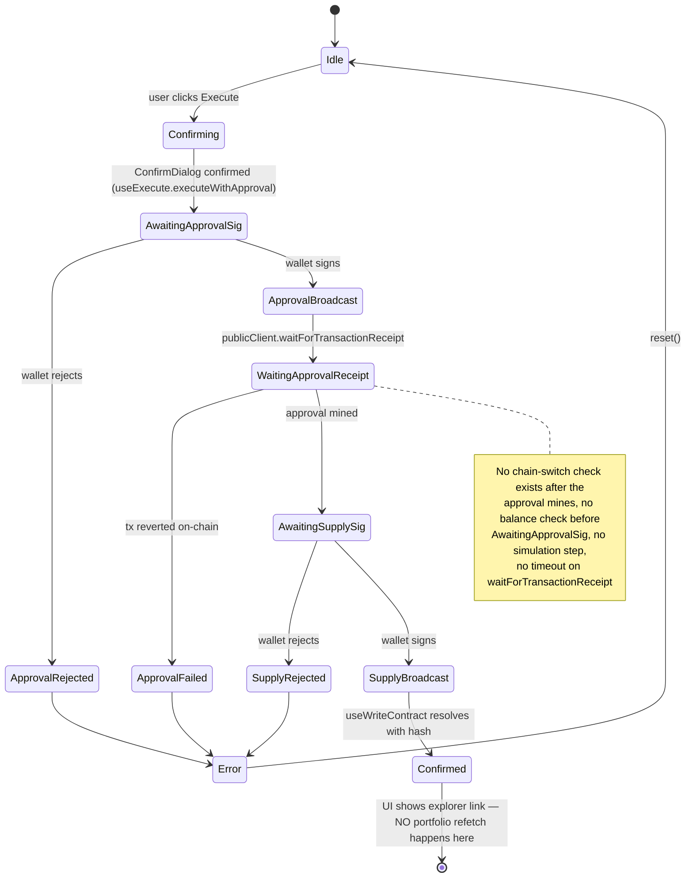

# Meridian — Execution Layer Audit

**Scope:** audit only, no code changes. Produced by inspecting `Edoouuard/meridian-terminal` at `master` (`d418c93`, 2026-10-05). Focus: the path from a user's intent/approved recommendation to a signed, confirmed on-chain transaction, and the portfolio refresh after.

---

## 1. Existing execution-related surface

### Core libs (pure, offline — no network/signing)
| File | Role |
|---|---|
| `src/lib/execution.ts` (913 lines) | `buildExecution(order)` — turns a protocol-agnostic `Order` into a concrete wagmi `ExecutionPlan` (address/abi/functionName/args/value). Also `normalizeAmount` (decimal-string → base-unit bigint, hard-fails on over-precision) and `applySender` (patches `onBehalfOf`/`receiver`/tuple fields with the connected wallet at execute-time). Supports protocols: `aave`, `compound`, `eth`, `erc20`, `lido`, `uniswap`, `morpho`, `spark`, `maker`, `weth`, `rocketpool`, `frax`. Fully unit-tested (`execution.test.ts`, 50+ cases) for every protocol **except live wiring** — the tests only exercise the pure plan builder, never a hook or a real/mocked chain call.
| `src/lib/assetMap.ts` (27KB) | `resolveOrderForLeg(leg, address, prices, chainId)` — maps a parsed `TradeLeg` to a concrete `Order`, or `{ unsupported }`. Hard-fails sizing without a live price (`quote.ts`). `approveOrderFor(order)` — **unconditionally** builds an ERC-20 approve step for every protocol/order-type combo that needs one; it never reads the current on-chain allowance, so every supply/repay/swap/deposit always inserts an approve leg even when allowance is already sufficient.
| `src/lib/onchain.ts` (26KB) | The allowlist: `AAVE_V3_POOL_BY_CHAIN`, `SPARK_POOL_BY_CHAIN`, `COMPOUND_V3_USDC_COMET_BY_CHAIN`, `LENDING_POOLS_BY_CHAIN`, `TRACKED_TOKENS_BY_CHAIN` (curated ERC-20s per chain, with `decimals`), `ERC20_ABI`, `AAVE_POOL_ABI` (read), `COMET_ABI` (read). Every address carries a comment citing its verification source (aave-address-book, Compound's own deployment registry, Etherscan family). This **is** the versioned config module the audit was asked to look for — it already exists and is already the single source of truth; `execution.ts` never hardcodes an address outside it.
| `src/lib/quote.ts` | `usdToTokenAmount` — USD notional → exact base-unit amount from a live price. Returns `null` (hard-fail) on missing/invalid price; never approximates.
| `src/lib/safety.ts` | `assessHealthFactorGuardrail` — pure HF-lowering guardrail for `borrow`/`withdraw` only. Not relevant to a `supply` (supply never lowers HF), included for completeness.
| `src/lib/tradePlan.ts` | NL thesis → `TradePlan` (array of `TradeLeg`). Upstream of `assetMap.ts`; out of scope for the execution fix but is where a leg's `protocol`/`side`/`asset`/`sizeUsd` originate.
| `src/lib/history.ts` | `recordExecution()` — localStorage-backed order history (the "local audit trail" the task asks for already exists, client-side only, no server log).

### Hooks (wagmi-bound, stateful — **zero test coverage**, no `*.test.ts` exists for anything in `src/hooks/`)
| File | Role |
|---|---|
| `src/hooks/useExecute.ts` | Single-order execution. `execute(order)` and `executeWithApproval(approve, order)`. State: `idle \| confirming \| confirmed \| error`. Validates wallet connected + correct chain, builds the plan, patches sender, submits via `writeContractAsync`/`sendTransactionAsync`, and for the approval path **waits for the approve tx receipt** before submitting the main tx (correct — this is what prevents the classic "supply reverts because allowance isn't live yet" bug). Handles the USDT double-approve quirk. Idempotency guard via a ref (blocks double-submit from a double-click).
| `src/hooks/useStrategyExecutor.ts` | Multi-leg sequential version of the same flow, adding chain-switching (`switchChainAsync`) between legs and a per-leg progress state (`pending/switching-chain/approving/executing/confirmed/error/skipped`).
| `src/hooks/useHealthPreview.ts` + `src/app/api/preview-action/route.ts` + `mcp/aave.ts: previewAaveAction` | A **live** Aave-MCP-backed health-factor simulator. Fully implemented end-to-end (hook → API route → MCP call). **Not called from anywhere in the UI** — not in `ThreadCard.tsx`, not in `RiskPanel.tsx`, not in `VaultRiskPanel.tsx`. Confirmed by grep. This is real, working simulation capability that is currently dead code from the user's perspective.
| `src/hooks/useLivePortfolio.ts` | Read-only portfolio aggregation via `wagmi`'s `useBalance`/`useReadContracts` (native balances, ERC-20 balances, Aave/Spark `getUserAccountData`, Compound Comet balances) plus Morpho's indexer. **No `watch: true`, no `refetchInterval`, and no call site anywhere invalidates or refetches these queries when a transaction confirms.** They only re-run on mount, on account/chain change, or a manual page reload.

### UI
| File | Role |
|---|---|
| `src/components/ThreadCard.tsx` (1726 lines) | The actual orchestrator. `ExecuteButton` (single order, used for Aave/Spark/Compound/Maker/WETH/transfers), `ExecuteStrategyButton` (multi-leg, wraps `useStrategyExecutor`), plus venue-specific buttons (`SwapExecuteButton` with a **live on-chain `useSimulateContract` quote** for Uniswap's QuoterV2, `MorphoExecuteButton`/`MorphoWithdrawButton`, `LidoUnstakeButton`, three perp buttons). Every execute path opens `ConfirmDialog` first and logs the outcome to `history.ts`.
| `src/components/ConfirmDialog.tsx` | The actual "preview before signing" surface — shows the human-readable description, a funds-moving warning, and (when applicable) the health-factor guardrail panel. Disables the confirm button when the guardrail says `refused`.

### Provider clients / env vars
- No RPC URL env vars exist — `src/lib/wagmi.ts` uses bare viem `http()` transports (the chain's built-in default public RPC) for all 16 chains. Fine for read-heavy wagmi calls but is a rate-limit risk under any real load; not a blocker for a single-user golden path.
- `AAVE_MCP_URL` / `HYPERLIQUID_MCP_URL` env vars exist (`mcp/aave.ts`, `mcp/hyperliquid.ts`) but are **not** on the Aave-supply execution path itself (they feed yield context + the orphaned health-preview feature) — the actual supply transaction is built entirely from `onchain.ts`'s hardcoded, verified addresses. No external config is required to execute an Aave supply.

---

## 2. Current coverage

- **Chains (16):** Ethereum, Base, Arbitrum, Optimism, Polygon, Avalanche, BNB, Gnosis, Scroll, zkSync, Linea, Mantle, Metis, Fantom, Sonic, Celo.
- **Tokens:** curated per-chain list in `TRACKED_TOKENS_BY_CHAIN` (`onchain.ts`). USDC is tracked with correct 6-decimal entries on every one of the 16 chains.
- **Protocols with a live, wallet-executable path:** Aave v3 (supply/repay/borrow/withdraw, 16 chains), Spark (supply/repay/borrow/withdraw, mainnet+Gnosis), Compound III USDC market (supply/repay/borrow/withdraw, 6 chains), Maker sDAI (supply/withdraw, mainnet), Lido (stake all chains N/A — mainnet only; unstake/claim mainnet), Rocket Pool (stake, mainnet), Frax (stake, mainnet), WETH (wrap/unwrap), Uniswap v3 (swap, with live QuoterV2 slippage), Morpho (supply via live Philidor vault discovery, withdraw via live Morpho indexer), native ETH / ERC-20 transfer.
- **Perps (separate signing paths, not wagmi writeContract):** Hyperliquid (EIP-712 via connected wallet), Extended (StarkEx, needs a separate Extended account), Ondo/Lighter (via LI.FI Perps SDK).
- **Route providers:** none yet in the "deBridge/LI.FI aggregator" sense — this audit is scoped to the single-chain Aave path, which needs no router at all.

---

## 3. Per-action state classification

| Action | State |
|---|---|
| **Aave v3 supply (USDC, same chain)** | **Transaction is built and sent, but two real gaps before it's production-safe:** (a) no pre-flight balance check, (b) no portfolio refresh after confirmation. See §4. Everything else — ABI, plan building, sender patching, approve-then-wait-then-supply sequencing, USDT-style double-approve handling, confirm dialog, history logging — **works end-to-end** and is unit-tested at the `buildExecution` layer. |
| Aave v3 repay/borrow/withdraw | Same wiring as supply; borrow/withdraw additionally route through `assessHealthFactorGuardrail`, which in practice is **always `computable:false`** (no live HF is ever passed in from `ThreadCard`) — so every borrow/withdraw gets the generic "I understand — Sign anyway" double-confirm rather than a real number, even though a live number is one hook call away (`useHealthPreview`) and simply isn't wired up. |
| Spark / Compound III / Maker sDAI | Works end-to-end, same caveats as Aave. |
| Uniswap v3 swap | Works end-to-end; actually simulates (`useSimulateContract` against QuoterV2) before building the order — the most complete flow in the codebase today. |
| Lido stake / Rocket Pool / Frax stake | Works end-to-end (native ETH, no approval needed). |
| Lido unstake/claim | Works end-to-end; a two-step async flow (request → wait days → claim) by Lido's own design, correctly represented as two separate orders. |
| Morpho supply/withdraw | Works end-to-end; supply picks a vault live via Philidor risk data and is gated below a minimum risk score; withdraw reads the user's real position from Morpho's indexer first. |
| WETH wrap/unwrap | Works end-to-end. |
| Native ETH / ERC-20 transfer | Works end-to-end. |
| Health-factor live simulation (`useHealthPreview`) | **Built but orphaned** — fully implemented, never called. Not "mock" (it's real), just disconnected. |
| Perp venues (Hyperliquid/Extended/Ondo/Lighter) | Working but entirely separate signing paths (EIP-712 / StarkEx), **explicitly out of scope** per this task's "no perps" instruction. |
| Portfolio refresh post-confirmation | **Missing.** No query invalidation/refetch anywhere after a tx confirms. |
| Unsafe / must-disable | **None found.** No path lets an LLM/URL/arbitrary-API response supply a contract address or ABI — every address and ABI originates from `onchain.ts`/`execution.ts` constants. No unlimited (`MaxUint256`) approvals — every approve amount equals the exact order amount. |

---

## 4. Concrete gaps on the Aave-USDC-supply path

1. **No pre-signature balance check.** `ExecuteButton`/`ConfirmDialog` never compares `order.amount` against the wallet's real USDC balance on that chain before opening the wallet. A user supplying more than they hold gets a wallet-level revert (wasted gas, confusing "Transaction failed: ..." message) instead of a clear, pre-emptive "insufficient balance" refusal. `useLivePortfolio` already reads this balance elsewhere in the app — it's just not cross-checked at the point of execution.
2. **No portfolio refresh after confirmation.** `useLivePortfolio`'s `useReadContracts`/`useBalance` calls have no `watch`, no `refetchInterval`, and nothing in `useExecute`/`useStrategyExecutor`/`ThreadCard` calls `queryClient.invalidateQueries` or any `refetch()` on confirmation. The user has to reload the page (or wait for an unrelated re-render) to see the new Aave position.
3. **No explicit transaction simulation before signing** for Aave (unlike the Uniswap path, which does call `useSimulateContract`). `buildExecution` is pure/offline; the wallet's own `eth_estimateGas` at signing time is the only implicit check, and its failure surfaces post-hoc as a generic wallet error rather than a pre-signature "this would revert" message.
4. **No on-chain allowance read.** `approveOrderFor` always inserts an approve step, even when a prior approval already covers the amount. Not unsafe (approve amount is always exact, never unlimited) but means every single supply costs two signatures instead of one when it doesn't need to — directly contrary to the two-path requirement ("sufficient allowance → skip straight to supply").
5. **No plan expiry / plan ID / schema version.** `Order`/`ExecutionPlan` carry no `planId`, no `createdAt`/`expiresAt`, no version tag. A plan built from a stale price quote has no mechanism to self-invalidate before signing.
6. **Error taxonomy is coarser than the requested state machine.** Current errors collapse into: wallet-not-connected, wrong-chain (checked explicitly and well — `preparePlan` compares `order.chainId` to the connected chain before building anything), a reject/decline regex match, or a generic "Transaction failed: `<message>`" string. There is no distinct `SIMULATION_FAILED`, `INSUFFICIENT_BALANCE`, `PLAN_EXPIRED`, or `CONFIRMATION_TIMEOUT` — the last matters because `publicClient.waitForTransactionReceipt({ hash })` has no timeout argument anywhere, so a stalled RPC/mempool tx hangs the UI in "confirming" indefinitely rather than surfacing a timeout.
7. **Decimal/unit handling is actually solid** — `normalizeAmount` hard-fails on over-precision strings rather than rounding, and USDC's 6 decimals are correct in `TRACKED_TOKENS_BY_CHAIN` on every chain. No risk found here.
8. **Stale-quote risk is low for this specific path** — a plain Aave supply doesn't depend on a price quote the way a swap does (the user-entered USDC amount is the USDC amount); the quote layer only matters for sizing from a USD notional, which already hard-fails to `null`/`{unsupported}` rather than approximating.

---

## 5. Transaction-state diagram — current implementation (Aave supply)

What's missing relative to the requested state machine: `VALIDATING` (balance/expiry checks) and `SIMULATING` as explicit, visible states before `READY_FOR_SIGNATURE` — today "ready for signature" and "idle" are the same state, and validation is just the wrong-chain check buried inside `preparePlan`.

---

## 6. Smallest safe golden path, given what already exists

The fastest, lowest-risk route to the requested flow (USDC supply to Aave v3, same chain, user-signed, confirmed, portfolio refreshed) is **not a rewrite** — `buildExecution`, `applySender`, `useExecute.executeWithApproval`, `ConfirmDialog`, and `onchain.ts`'s allowlist are already correct and already tested. The gap is four additions layered on top, in this order:

1. **Pre-flight validation step** (new, small, pure): given `order` + the connected wallet's live USDC balance (already available via `useBalance`/`useReadContracts`-style reads) + a plan timestamp, return one of `OK | INSUFFICIENT_BALANCE | WRONG_CHAIN | PLAN_EXPIRED`. Wire it into `ExecuteButton` before `setConfirming(true)` so a doomed signature never opens the wallet.
2. **An explicit simulate step** using wagmi's `useSimulateContract`/`publicClient.simulateContract` against the exact built plan (mirroring what `SwapExecuteButton` already does for Uniswap's quote), surfaced in `ConfirmDialog` as a pass/fail before the confirm button is enabled.
3. **An on-chain allowance read** (`publicClient.readContract` on `allowance(owner, spender)`) consulted by `approveOrderFor`'s call site so a sufficient existing allowance skips straight to the supply call — the two-path branch the spec asks for.
4. **Post-confirmation refetch**: after `useExecute`'s `status` reaches `confirmed`, invalidate/refetch the specific `useReadContracts`/`useBalance` queries `useLivePortfolio` uses for that chain + USDC + the Aave pool (react-query's `queryClient.invalidateQueries` with the matching query keys, or simplest: expose a `refetch()` from `useLivePortfolio` and call it from `ThreadCard` on confirmation), with a short "pending position" placeholder shown in between.

No change is needed to: `onchain.ts` (allowlist already correct), `buildExecution`'s Aave branch (already correct), the approve-then-wait-then-supply sequencing (already correct), `ConfirmDialog`'s guardrail rendering (unaffected — supply isn't HF-lowering), or any read-only portfolio/analytics code.

---

## Top 5 execution blockers (ranked)

1. **No portfolio refresh after confirmation** — the single biggest "feels broken" gap; the user signs successfully and the UI doesn't reflect it.
2. **No pre-signature balance check** — the most common real-world failure mode (fat-fingered or stale-displayed amount) surfaces as a confusing on-chain revert instead of a clear refusal.
3. **No simulation step for Aave** (unlike Uniswap) — the one meaningful safety gap between "built" and "safe to always sign."
4. **No on-chain allowance check** — not unsafe, but doubles signature count on every supply; directly contradicts the requested two-path behavior.
5. **No plan expiry / timeout handling** — `waitForTransactionReceipt` can hang forever; there's no `planId`/`expiresAt` to invalidate a stale plan before signing.

## Precise files to modify (phase 2, not yet started)

- `src/lib/execution.ts` — extend `Order`/`ExecutionPlan` with `planId`/`createdAt`/`expiresAt` (additive, optional fields — existing tests keep passing).
- `src/lib/assetMap.ts` — `approveOrderFor` call sites need an allowance-aware wrapper (new function, e.g. `resolveApprovalNeed(order, currentAllowance)`), not a rewrite of the existing one.
- `src/hooks/useExecute.ts` — add a `validate()`/`simulate()` step before `preparePlan` is allowed to proceed to `confirming`; add a `refetch` callback parameter or emit a confirmation event `ThreadCard`/`useLivePortfolio` can subscribe to.
- `src/hooks/useLivePortfolio.ts` — expose a `refetchAll()` (wrap the existing `useReadContracts`/`useBalance` refetch functions) for the above to call.
- `src/components/ThreadCard.tsx` (`ExecuteButton`) — call the new validation/simulation before `setConfirming(true)`; call `refetchAll()` on confirmation.
- `src/components/ConfirmDialog.tsx` — render the simulation result (pass/fail + gas estimate) alongside the existing guardrail panel.
- New: `src/lib/execution.test.ts` additions + new `src/hooks/useExecute.test.ts` (none exists today) for the mocked-wallet cases the task lists (insufficient balance, wrong network, expired plan, rejected approval/signature, confirmed + refetch).

## Required external configuration

**None for the golden path itself.** No new env var, API key, or contract deployment is needed — `AAVE_V3_POOL_BY_CHAIN` already lists verified pool addresses for all 16 chains and `TRACKED_TOKENS_BY_CHAIN` already lists verified USDC addresses for all 16. The only thing worth flagging: `wagmi.ts`'s bare `http()` transports use each chain's public default RPC with no API key — fine for a single user testing this flow, but worth an RPC provider URL (Alchemy/Infura/etc.) before any real usage volume, since simulation + allowance reads add 2 extra RPC calls per action.
